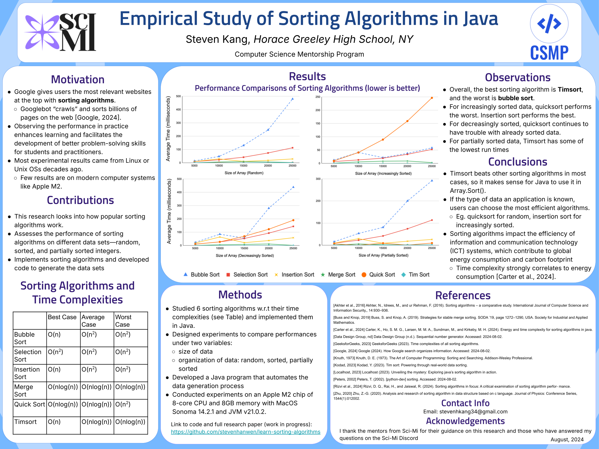
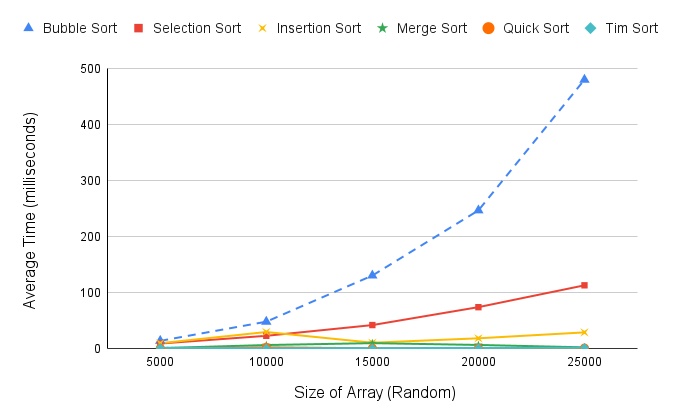
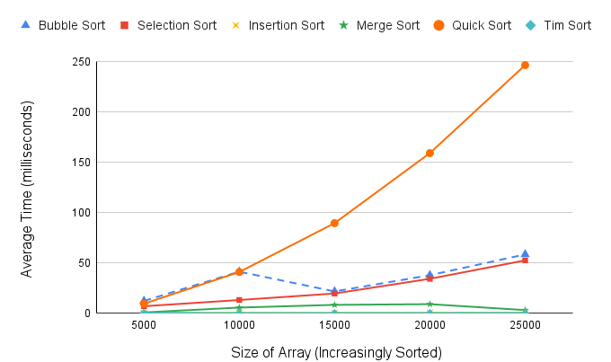
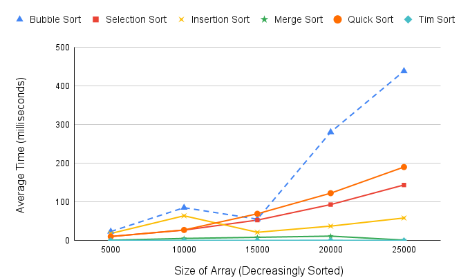
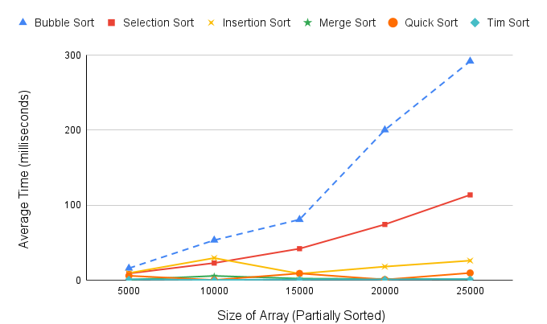

# learn-sorting-algorithms
This is a performance study of six different sorting algorithms (bubble sort, inerstion sort, selection sort, merge sort, Timsort, Quicksort).

### Presentation poster at the virtual symposium.

### Performance comparison between sorting algorithms for partially sorted integers.

### Performance comparison between sorting algorithms for partially sorted integers.

### Performance comparison between sorting algorithms for partially sorted integers.

### Performance comparison between sorting algorithms for partially sorted integers.
